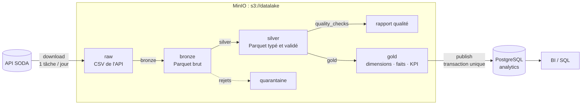
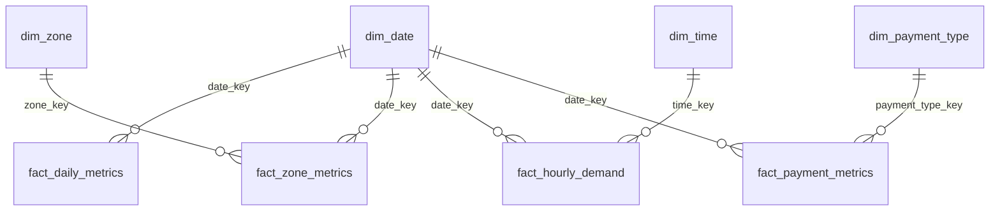

# Chicago Taxi Trips : pipeline medallion (Airflow + PySpark + MinIO + PostgreSQL)

## Sommaire

1. [Présentation du projet](#1-présentation-du-projet)
2. [Objectifs métier](#2-objectifs-métier)
3. [Architecture](#3-architecture)
4. [Points clés d'ingénierie](#4-points-clés-dingénierie)
5. [Flux de données](#5-flux-de-données)
6. [Modèle de données](#6-modèle-de-données)
7. [Qualité des données](#7-qualité-des-données)
8. [Résultats d'exécution](#8-résultats-dexécution)
9. [Démarrage rapide](#9-démarrage-rapide)
10. [Structure du projet](#10-structure-du-projet)
11. [Choix techniques](#11-choix-techniques)
12. [Limites](#12-limites)
13. [Améliorations possibles](#13-améliorations-possibles)
14. [Tests](#14-tests)
15. [Documentation](#15-documentation)

---

## 1. Présentation du projet

Pipeline de données de bout en bout, exécutable en local avec Docker Compose :

- ingestion de l'API SODA du portail open data de Chicago
  ([Taxi Trips 2013-2023](https://data.cityofchicago.org/Transportation/Taxi-Trips-2013-2023-/wrvz-psew)) ;
- traitement en couches **raw → bronze → silver → gold** avec PySpark, sur un stockage
  objet S3 (MinIO) ;
- contrôles qualité bloquants ;
- publication d'un modèle gold dimensionnel dans PostgreSQL pour l'équipe BI ;
- orchestration par Airflow.

**Période de référence : 1er trimestre 2023** (2023-01-01 → 2023-03-31), soit
1,45 million de trajets.

| Critère | Arbitrage |
|---|---|
| Volume | 9 000 à 22 000 trajets par jour : assez pour exercer Spark, le partitionnement et les contrôles, sans saturer un poste. |
| Temps d'exécution | Le téléchargement est le facteur limitant (5 à 25 s par jour sans token) ; avec 4 téléchargements en parallèle, le run complet a pris 8 min. |
| Reproductibilité | Les données 2023 sont figées : un nouveau run produit les mêmes chiffres. |
| Représentativité | Toutes les combinaisons jour de semaine × heure, des jours fériés, un changement d'heure et une évolution hebdomadaire. |

La période est un paramètre du run Airflow : on peut la réduire pour une démo ou
l'étendre sans modifier le code.

## 2. Objectifs métier

Une entreprise de mobilité urbaine veut des indicateurs fiables sur les trajets en
taxi. Questions couvertes par les tables gold publiées :

| Question | Table |
|---|---|
| Revenus par jour, revenu moyen par trajet | `gold_daily_metrics` |
| Durée moyenne et médiane des trajets par jour | `gold_daily_metrics` |
| Top zones de prise en charge (volume, revenu, durée) | `gold_pickup_zone_metrics` |
| Pics de demande par jour de semaine et heure | `gold_hourly_demand` |
| Analyses croisées (week-end, secteur, mois, moyen de paiement…) | faits et dimensions (`fact_*`, `dim_*`) |

## 3. Architecture



| Composant | Rôle |
|---|---|
| **Airflow 2.10** (`LocalExecutor`) | Orchestration, paramètres de run, retries, logs |
| **PySpark 3.5** (mode local) | Tous les traitements bronze → gold et la publication JDBC |
| **MinIO** | Datalake compatible S3 (`s3a://datalake`) |
| **PostgreSQL 16** | Métadonnées Airflow et base d'exposition BI `analytics` |
| **Docker Compose** | Environnement complet en une commande |

DAG `taxi_trips_pipeline` :

```
plan_days → download[×N jours] → bronze → silver → quality_checks → gold → publish
```

Le DAG ne fait qu'orchestrer ; la logique vit dans le package `src/taxi_pipeline`.
Détails : [docs/architecture.md](docs/architecture.md).

## 4. Points clés d'ingénierie

- **Airflow** : *dynamic task mapping* (une tâche de téléchargement par jour, 4 en
  parallèle), retries par tâche avec backoff, période paramétrable à chaque run, DAG
  limité à l'orchestration.
- **Ingestion robuste et idempotente** : pagination SODA à tri stable, mémoire bornée à
  une page, retries sur 429/5xx/erreurs réseau, marqueur `_SUCCESS` par jour. Un jour
  déjà ingéré n'est pas re-téléchargé ; un jour interrompu est repris proprement.
- **Architecture medallion** : raw (réponse API brute) → bronze (Parquet non transformé)
  → silver (typé, dédoublonné, validé) → gold, partitionnées par jour et rejouables par
  période (overwrite dynamique de partitions).
- **Transformations Spark natives** : fonctions pures sur DataFrames, testées
  unitairement ; pas d'UDF Python, pas de pandas ; jointures *broadcast* ; horodatages en
  `TIMESTAMP_NTZ`.
- **Quality gates et quarantaine** : chaque ligne invalide est isolée avec sa raison de
  rejet ; 23 contrôles sur la silver, dont 17 bloquants qui empêchent la construction de
  la gold.
- **Gold dimensionnelle** : 4 dimensions et 4 faits à grain explicite, grain vérifié et
  faits réconciliés avec la silver avant écriture ; les 3 tables KPI historiques sont
  dérivées des faits.
- **Publication atomique** : les 11 tables sont substituées dans PostgreSQL en une seule
  transaction, avec clés primaires et étrangères ; la BI ne voit jamais de modèle
  partiellement publié.

## 5. Flux de données

| Étape | Entrée → sortie | Traitement |
|---|---|---|
| `download` | API SODA → `raw/taxi_trips/trip_date=…/page_*.csv` | Une requête paginée par jour, écriture page par page, marqueur `_SUCCESS` |
| `bronze` | raw → `bronze/taxi_trips` (Parquet, partition `trip_date`) | Aucune transformation métier ; colonnes de lignage ; contrôle du header (dérive de schéma) |
| `silver` | bronze → `silver/taxi_trips` + `silver/taxi_trips_rejected` | Typage, normalisation, dédoublonnage, 13 règles de rejet, colonnes dérivées |
| `quality_checks` | silver → `quality_reports/…/report.json` | 23 contrôles en une agrégation ; échec bloquant si un CRITICAL échoue |
| `gold` | silver → `gold/<table>` | Dimensions, faits, KPI ; unicité du grain et réconciliation avant écriture |
| `publish` | gold → PostgreSQL `analytics` | Staging JDBC puis substitution transactionnelle, clés, contrôle des comptages |

Idempotence et reprise : un run ne remplace que les partitions de sa période ; la gold
est recalculée sur toute la silver disponible. Détails :
[docs/architecture.md](docs/architecture.md).

## 6. Modèle de données

| Type | Tables | Grain |
|---|---|---|
| Dimensions | `dim_date`, `dim_zone` (77 zones + inconnue), `dim_payment_type`, `dim_time` | une ligne par membre |
| Faits | `fact_daily_metrics` | jour |
| | `fact_zone_metrics` | jour × zone de prise en charge |
| | `fact_hourly_demand` | jour × heure |
| | `fact_payment_metrics` | jour × moyen de paiement |
| Sorties KPI | `gold_daily_metrics`, `gold_pickup_zone_metrics`, `gold_hourly_demand` | jour ; zone sur la période ; jour de semaine × heure |



- **Mesures additives** (comptes, sommes) dans chaque fait : toute moyenne sur une
  période plus large se recalcule exactement, sans moyenne de moyennes.
- **Sorties KPI conservées** avec leur nom et leur schéma d'origine, dérivées des faits :
  les requêtes existantes ne changent pas.
- **Pas de fait au grain trajet** : les usages BI du sujet portent sur des KPI agrégés ;
  le détail par trajet reste dans la silver.

Détails, justifications et requêtes d'exemple : [docs/data-model.md](docs/data-model.md).

## 7. Qualité des données

| Niveau | Mécanisme | Effet en cas d'échec |
|---|---|---|
| Silver, par ligne | 13 règles de rejet (horodatages, durée, distance, vitesse, montants…) | Ligne en quarantaine avec sa `reject_reason` |
| Silver, globale | 23 contrôles : 17 CRITICAL (nullité, doublons, bornes, période, taux de rejet ≤ 10 %…) et 6 WARNING | CRITICAL : le DAG échoue, la gold n'est pas construite |
| Gold | Unicité du grain des 11 tables ; réconciliation de chaque fait avec la silver | La tâche échoue, rien n'est écrit |
| Publication | Clés primaires et étrangères dans PostgreSQL | Rollback, la version précédente reste en place |

**Constat issu du contrôle qualité** : le premier run a révélé que 25 % des trajets ne
vérifiaient pas `trip_total = fare + tips + tolls + extras`. L'analyse a montré un frais
fixe de 0,50 $ ou 1,00 $ sur les paiements par carte et mobile, absent des composantes.
La règle modélise ce frais au lieu d'abaisser le seuil ; la cohérence est de 99,99 %
sur le T1 2023.

Détails : [docs/data-quality.md](docs/data-quality.md).

## 8. Résultats d'exécution

Run de référence : T1 2023, sur des volumes Docker vides (datalake et base neufs), avec
la gold dimensionnelle. Poste Windows, Docker Desktop, 8 Go alloués.

| Mesure | Résultat |
|---|---:|
| Période | 2023-01-01 → 2023-03-31 (90 jours) |
| Lignes ingérées (raw → bronze) | 1 446 439 |
| Lignes silver valides | 1 417 116 |
| Lignes rejetées (quarantaine) | 29 323 |
| Taux de rejet | 2,0 % |
| Doublons de `trip_id` | 0 |
| Contrôles qualité | 23 / 23 réussis |
| Période gold | 2023-01-01 → 2023-03-31 |
| Zones | 78 (77 *community areas* + inconnue) |
| Publication PostgreSQL | 11 tables (4 dimensions, 4 faits, 3 KPI), 11 clés primaires, 7 clés étrangères |
| Étapes Spark (bronze → publish) | 2 min 24 s |
| Durée de bout en bout | 8 min (premier run complet, téléchargements compris) |

**Durée des étapes** (run de référence) : bronze 28 s · silver 47 s · quality_checks
17 s · gold 36 s · publish 16 s. Dans ce run, le téléchargement a subi des pannes
réseau (échecs DNS, connexions coupées) ; les retries ont absorbé ces pannes et le run a
réussi, mais sa durée totale (2 h 42) n'est pas représentative. Le premier run complet,
sans incident réseau, avait pris 8 min de bout en bout.

**Tables publiées** (lignes) : `dim_date` 90 · `dim_zone` 78 · `dim_payment_type` 7 ·
`dim_time` 24 · `fact_daily_metrics` 90 · `fact_zone_metrics` 6 977 ·
`fact_hourly_demand` 2 159 · `fact_payment_metrics` 621 · `gold_daily_metrics` 90 ·
`gold_pickup_zone_metrics` 78 · `gold_hourly_demand` 168.

**Stockage** (premier run) : raw CSV 644 Mo → bronze Parquet 114 Mo (÷ 5,6) → silver
121 Mo (colonnes dérivées ajoutées) ; quarantaine 5 Mo.

### Indicateurs

| Trajets | Revenu total | Revenu moyen / trajet | Durée moyenne | Jour le plus calme / le plus chargé |
|---|---|---|---|---|
| 1 417 116 | 36,45 M$ | 25,72 $ | 19,4 min | 8 878 / 22 267 trajets |

**Top 5 des zones de prise en charge** (`gold_pickup_zone_metrics`) :

| rank | zone_name | nb_trips | share_of_trips_pct | total_revenue | avg_revenue_per_trip | avg_trip_minutes |
|---|---|---|---|---|---|---|
| 1 | Near North Side | 299 180 | 21,11 | 4 569 950,94 | 15,27 | 12,90 |
| 2 | O'Hare | 239 038 | 16,87 | 12 539 612,94 | 52,46 | 31,19 |
| 3 | Loop | 225 353 | 15,90 | 3 495 312,70 | 15,51 | 12,68 |
| 4 | Near West Side | 137 902 | 9,73 | 2 067 404,59 | 14,99 | 13,38 |
| 5 | Unknown / outside Chicago | 84 517 | 5,96 | 3 319 022,78 | 39,27 | 24,38 |

Lecture : trois zones concentrent 54 % des prises en charge. O'Hare génère le plus de
revenus (34 % du total) avec des trajets 3,4 fois plus chers que ceux du centre. Le pic
de demande tombe le jeudi entre 16 h et 18 h (environ 1 400 trajets par heure).

### Reproductibilité et non-régression

- Le run de référence, sur volumes vides, retrouve exactement les chiffres du premier
  run : lignes bronze, silver et rejetées (y compris la ventilation par raison), 23/23
  contrôles, revenu total de 36 452 368,07 $.
- Un environnement isolé et neuf (projet Compose distinct) a exécuté le DAG sur
  2023-03-29 → 2023-03-31 sans intervention manuelle ; les métriques journalières comparées (trajets, revenu, durée moyenne) sont
  identiques au centime près à celles du run complet.
- Passage à la gold dimensionnelle : 3 293 des 3 294 cellules des tables KPI sont
  identiques à la version précédente. Seule différence : la médiane de durée d'un jour,
  causée par `percentile_approx`, dont le résultat dépendait de l'ordre des lignes. La
  médiane est depuis calculée exactement
  ([docs/data-quality.md](docs/data-quality.md#6-non-régression-lors-du-passage-à-la-gold-dimensionnelle)).

## 9. Démarrage rapide

**Prérequis** : Docker Desktop (ou Docker Engine) avec Compose v2, ~4 Go de RAM pour
Docker, accès internet, ports libres 8080, 9000, 9001 et 5433. Aucune installation de
Python, Java ou Spark sur le poste.

```bash
git clone https://github.com/artefactory-ma/test_technique_data_engineer_ma.git
cd test_technique_data_engineer_ma
git switch feature/taxi-pipeline-airflow
cp .env.example .env              # optionnel : toutes les valeurs ont un défaut
docker compose up -d --build
docker compose ps                 # attendre airflow-webserver "healthy" (~1-2 min)
```

`airflow-init` migre la base Airflow et crée l'admin, `minio-init` crée le bucket, et
PostgreSQL crée la base `analytics` : aucune étape manuelle.

**Lancer le pipeline** : dans l'UI (http://localhost:8080 → `taxi_trips_pipeline` →
*Trigger DAG w/ config*), ou en ligne de commande :

```bash
# période par défaut (T1 2023)
docker compose exec airflow-scheduler airflow dags trigger taxi_trips_pipeline

# autre période (bash, zsh, PowerShell 7+)
docker compose exec airflow-scheduler airflow dags trigger taxi_trips_pipeline \
  --conf '{"start_date": "2023-01-01", "end_date": "2023-01-07"}'
```

> **Windows PowerShell 5.1** supprime les guillemets internes des arguments passés à
> `docker` : il faut les échapper.
>
> ```powershell
> docker compose exec airflow-scheduler airflow dags trigger taxi_trips_pipeline --conf '{\"start_date\":\"2023-01-01\",\"end_date\":\"2023-01-07\"}'
> ```

Paramètres du run : `start_date`, `end_date`, `force_download` (re-télécharge les jours
déjà ingérés). Suivi : vue *Grid* de l'UI ou `docker compose logs -f airflow-scheduler`.

**Accès**

| Service | Accès | Identifiants |
|---|---|---|
| Airflow | http://localhost:8080 | admin / admin |
| Console MinIO | http://localhost:9001, bucket `datalake` | minioadmin / minioadmin |
| PostgreSQL (BI) | `localhost:5433`, base `analytics` | analytics / analytics |
| Spark UI | http://localhost:4040, pendant une tâche Spark | — |

```bash
docker compose exec postgres psql -U analytics -d analytics
```

```sql
SELECT trip_date, nb_trips, total_revenue, avg_trip_minutes
FROM gold_daily_metrics ORDER BY trip_date;

SELECT rank, zone_name, nb_trips, share_of_trips_pct, total_revenue
FROM gold_pickup_zone_metrics ORDER BY rank LIMIT 10;
```

Le port hôte est 5433 (et non 5432) pour éviter un PostgreSQL installé localement ; il
se change avec `POSTGRES_HOST_PORT`.

**Configuration** : tous les paramètres (période, API, identifiants, Spark, seuils
qualité) sont dans `.env.example` et lus par `src/taxi_pipeline/config.py`. Les
identifiants par défaut sont réservés à un usage local, et `.env` est ignoré par Git.

**Téléchargement seul** (même code que la tâche `download`) :

```bash
docker compose exec airflow-scheduler python scripts/download_data.py \
  --start 2023-02-01 --end 2023-02-07 --page-size 20000 --max-rows-per-day 5000
```

**Arrêt** : `docker compose down` conserve les données ; `docker compose down -v`
supprime aussi MinIO, PostgreSQL et les logs.

## 10. Structure du projet

```
.
├── dags/taxi_trips_pipeline.py        # orchestration uniquement
├── src/taxi_pipeline/
│   ├── config.py                      # configuration centralisée (variables d'environnement)
│   ├── tasks.py                       # points d'entrée des étapes (DAG + scripts)
│   ├── ingestion/soda.py              # client SODA : pagination, retries, idempotence
│   ├── bronze/job.py                  # raw CSV -> bronze Parquet
│   ├── silver/transform.py, job.py    # transformations pures (testables), lecture / écriture
│   ├── quality/checks.py, job.py      # métriques, règles, rapport, échec bloquant
│   ├── gold/
│   │   ├── dimensions.py              # dim_date, dim_zone, dim_payment_type, dim_time
│   │   ├── facts.py                   # faits et leur grain
│   │   ├── kpis.py                    # sorties KPI dérivées des faits
│   │   ├── tables.py                  # catalogue : grain, clés étrangères, nom publié
│   │   ├── validation.py              # unicité du grain, réconciliation avec la silver
│   │   └── job.py                     # orchestration de la couche gold
│   ├── publish/postgres.py            # publication atomique vers PostgreSQL
│   ├── utils/                         # Spark, stockage objet, logs et durées
│   └── seeds/community_areas.csv      # référentiel des 77 zones de Chicago
├── scripts/
│   ├── download_data.py               # téléchargement reproductible (CLI)
│   └── run_local.py                   # exécution des étapes sans Airflow
├── tests/
│   ├── unit/                          # ingestion, silver, qualité, gold, publication
│   ├── integration/                   # raw -> bronze -> silver -> quality -> gold
│   └── fixtures/                      # 40 trajets réels de l'API + 5 anomalies injectées
├── docs/                              # architecture, qualité, modèle, décisions
├── docker/postgres/init-analytics-db.sh
├── Dockerfile                         # Airflow + Java 17 + PySpark + connecteurs S3A/JDBC
├── docker-compose.yml
├── requirements.txt / requirements-dev.txt
└── .env.example
```

## 11. Choix techniques

| Choix | Raison principale |
|---|---|
| **Airflow** | Standard de l'orchestration batch ; *dynamic task mapping* pour retries et reprise au grain du jour ; `LocalExecutor` suffisant en local. |
| **PySpark local** | Imposé par le sujet ; code identique quel que soit le volume, prêt pour un cluster ; aucun cluster à maintenir ici. |
| **MinIO** | API S3 : le même code `s3a://` fonctionnerait sur AWS S3. |
| **Parquet** | Colonnaire, compressé, typé ; partition par jour pour le pruning et le rejeu. |
| **Raw CSV avant la bronze** | Réponse exacte de l'API conservée : audit et rejeu sans rappeler l'API. |
| **Quarantaine** | Rejets mesurables et auditables plutôt que supprimés silencieusement. |
| **`TIMESTAMP_NTZ`** | La source est en heure locale de Chicago sans fuseau ; NTZ évite toute réinterprétation selon le fuseau du poste. |
| **Gold dimensionnelle** | Dimensions réutilisables et faits à grain explicite ; les KPI orientés BI sont dérivés des faits. Modèle réutilisable, sans fait au grain trajet inutile pour les cas d'usage du sujet. |
| **Gold recalculée intégralement** | Classements et parts dépendent de toute la donnée ; simple et sûr à ce volume. |
| **PostgreSQL** | Lu par tous les outils BI ; substitution transactionnelle des tables. |

Contexte, raisons et compromis de chaque décision :
[docs/technical-decisions.md](docs/technical-decisions.md).

## 12. Limites

- **Spark en mode local** dans le conteneur Airflow : pas de scalabilité horizontale.
- **Dépendance à l'API SODA** : sans token, le téléchargement est lent et peut être
  limité (429) ; les pannes réseau allongent le run (observé : 2 h 42 au lieu de 8 min),
  même si les retries évitent l'échec.
- **Idempotence au grain du jour** : une ligne modifiée côté source après ingestion n'est
  reprise qu'avec `force_download`.
- **Pas de format transactionnel** (Delta, Iceberg) : l'overwrite dynamique de partitions
  n'est pas atomique sur S3 (sans impact ici : `max_active_runs=1`).
- **Petits fichiers** : une partition par jour produit des fichiers d'environ 1,3 Mo.
- **Gold recalculée intégralement** : son coût croît avec l'historique chargé.
- **Secrets en variables d'environnement** : acceptable en local uniquement.
- **Image MinIO figée** : `bitnamilegacy/minio` ne reçoit plus de mises à jour.
- **Zones** : 6 % des trajets n'ont pas de zone de prise en charge (hors Chicago ou
  masquée par la ville) et sont regroupés sous « Unknown / outside Chicago ».

## 13. Améliorations possibles

- **Incrémental** : planification quotidienne (`@daily` + `data_interval`), faits gold
  au grain jour mis à jour pour les seules dates traitées.
- **Delta Lake ou Iceberg** : écritures atomiques, `MERGE` pour les corrections de la
  source, *time travel*, évolution de schéma maîtrisée.
- **Partitionnement mensuel et compaction** quand le volume augmente.
- **Qualité** : contrôles déclaratifs (Great Expectations, Soda) et historique des
  métriques pour détecter les dérives.
- **Monitoring et alerting** : callbacks d'échec Airflow (Slack, e-mail), SLA, métriques
  Prometheus/Grafana.
- **CI/CD** : lint, tests et build de l'image à chaque PR.
- **Catalogue et lignage** : DataHub ou OpenMetadata, OpenLineage.
- **Spark sur cluster** (`SparkSubmitOperator`, Spark on Kubernetes) et réglages fins.
- **Gestion des secrets** : backend Airflow (Vault, AWS Secrets Manager).
- **Couche sémantique BI** au-dessus des tables gold.

## 14. Tests

73 tests, exécutés dans le conteneur (même environnement que le pipeline) :

```bash
docker compose exec airflow-scheduler python -m pytest -v
```

| Suite | Contenu |
|---|---|
| `tests/unit/test_ingestion.py` | Pagination, plafond de lignes, retries (429, 5xx, réseau, timeout, connexion coupée), échec immédiat sur 4xx, idempotence et reprise d'un jour interrompu (session HTTP simulée). |
| `tests/unit/test_silver.py` | Typage, normalisation, dédoublonnage, chacune des 13 règles de rejet (14 cas), cohérence des montants (dont les frais de paiement électronique). |
| `tests/unit/test_quality.py` | Évaluation des règles CRITICAL / WARNING, seuils configurables. |
| `tests/unit/test_gold.py` | Dimensions ; unicité du grain de chaque table ; réconciliation des faits avec la silver ; intégrité référentielle fait → dimension ; zone hors référentiel rattachée au membre inconnu ; équivalence des KPI avec un calcul direct ; médiane exacte et indépendante de l'ordre des lignes ; échec explicite des garde-fous. |
| `tests/unit/test_publish.py` | Ordre de la substitution atomique (drop → rename → clés primaires → clés étrangères), clés étrangères vers les dimensions publiées. |
| `tests/integration/test_pipeline.py` | 40 trajets réels de l'API + 5 anomalies traversent raw → bronze → silver → quality → gold sur un datalake local (grain et réconciliation vérifiés sur les tables écrites) ; idempotence de la silver ; échec bloquant d'un contrôle critique ; refus d'un téléchargement incomplet. |

Dernière exécution complète : 72 tests réussis, avant l'ajout du test de médiane exacte.

Hors Docker : `pip install -r requirements-dev.txt` puis `python -m pytest -v`
(Python 3.11 et Java 8/11/17 requis ; sous Windows, Spark a aussi besoin de
`winutils.exe` et `hadoop.dll`).

## 15. Documentation

| Document | Contenu |
|---|---|
| [docs/architecture.md](docs/architecture.md) | Composants, DAG et paramètres, ingestion, stockage et partitionnement, publication, déploiement Docker Compose, observabilité |
| [docs/data-quality.md](docs/data-quality.md) | Règles silver et quarantaine, quality gate, constat sur les montants, garde-fous gold, intégrité référentielle, non-régression |
| [docs/data-model.md](docs/data-model.md) | Dimensions, faits et leur grain, sorties KPI, choix de modélisation, requêtes d'exemple |
| [docs/technical-decisions.md](docs/technical-decisions.md) | Décisions techniques : contexte, décision, raisons, compromis |
