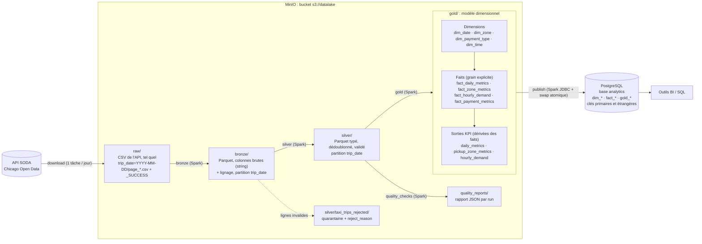

# Architecture

Ce document détaille l'architecture du pipeline : composants, flux de données,
orchestration Airflow, stockage et déploiement. Vue d'ensemble dans le [README](../README.md).

## Vue d'ensemble



## Composants

| Composant | Rôle | Implémentation |
|---|---|---|
| API SODA | Source : dataset *Taxi Trips (2013-2023)* (`wrvz-psew`) | `src/taxi_pipeline/ingestion/soda.py` |
| Airflow 2.10 | Orchestration (`LocalExecutor`), paramètres de run, retries, logs | `dags/taxi_trips_pipeline.py` |
| PySpark 3.5 | Tous les traitements bronze → gold et la publication JDBC, en mode local dans le conteneur Airflow | `src/taxi_pipeline/{bronze,silver,quality,gold,publish}/` |
| MinIO | Stockage objet compatible S3 : socle du datalake (`s3a://datalake`) | image `bitnamilegacy/minio:2024.10.13` |
| PostgreSQL 16 | Métadonnées Airflow (base `airflow`) et couche d'exposition BI (base `analytics`, rôle séparé) | `docker/postgres/init-analytics-db.sh` |
| Docker Compose | Environnement complet en une commande | `docker-compose.yml`, `Dockerfile` |

## DAG `taxi_trips_pipeline`

```
plan_days → download[×N jours] → bronze → silver → quality_checks → gold → publish
```

Le DAG ne fait qu'orchestrer. Chaque tâche appelle une fonction de
`src/taxi_pipeline/tasks.py`, qui construit la configuration, ouvre puis ferme sa propre
SparkSession, mesure la durée de l'étape et renvoie ses métriques (XCom et logs).

| Tâche | Rôle | Idempotence / reprise |
|---|---|---|
| `plan_days` | Liste les jours de la période demandée. | — |
| `download` | *Dynamic task mapping* : une tâche par jour, 4 en parallèle (`max_active_tis_per_dagrun=4`), 3 retries. Pagination SODA, écriture page par page dans `raw/`. | Un jour marqué `_SUCCESS` n'est pas re-téléchargé ; un jour interrompu est purgé puis repris. `force_download` pour forcer. |
| `bronze` | CSV → Parquet, sans transformation métier. Vérifie que tous les jours sont complets et que le header correspond au schéma attendu (détection de dérive de schéma). | Overwrite dynamique des seules partitions de la période. |
| `silver` | Typage, normalisation, dédoublonnage, règles de validité, colonnes dérivées. Les rejets partent en quarantaine avec leur raison. | Idem (testé : deux exécutions donnent le même résultat). |
| `quality_checks` | Contrôles sur la silver ; un contrôle **CRITICAL** en échec fait échouer le DAG : la gold n'est pas construite. | Pas de retry (un échec qualité est déterministe). |
| `gold` | Construit dimensions, faits puis sorties KPI à partir de toute la silver. Avant écriture : unicité du grain de chaque table et réconciliation de chaque fait avec la silver ; tout écart fait échouer la tâche. | Overwrite complet. |
| `publish` | Écrit chaque table dans une table `__staging`, puis les substitue toutes **dans une seule transaction** en posant clés primaires et étrangères ; vérifie les comptages. | Rejouable, la BI ne voit jamais de modèle partiellement publié ; une violation de clé annule tout. |

**Paramètres du run** (`Params` Airflow, modifiables à chaque déclenchement) :

| Paramètre | Défaut | Rôle |
|---|---|---|
| `start_date` | `TRIPS_START_DATE` (2023-01-01) | Premier jour inclus |
| `end_date` | `TRIPS_END_DATE` (2023-03-31) | Dernier jour inclus |
| `force_download` | `false` | Re-télécharge les jours déjà ingérés |

**Retries** : 2 par défaut avec backoff exponentiel (`retry_delay` 1 min), 3 pour
`download`, 0 pour `quality_checks`. Le DAG est manuel (`schedule=None`) avec
`max_active_runs=1`, ce qui évite deux écritures concurrentes sur le datalake.

## Ingestion

- **Une requête par jour**, filtrée sur `trip_start_timestamp`, paginée par
  `$limit`/`$offset` (50 000 lignes par page par défaut) avec un tri stable sur
  `trip_id`, pour qu'aucune ligne ne soit perdue ni dupliquée entre pages.
- **Mémoire bornée** : chaque page est écrite dès sa réception ; le processus ne tient
  jamais plus d'une page en mémoire, quel que soit le volume.
- **Erreurs HTTP** : retry avec backoff exponentiel (plafonné à 60 s) sur 429, 5xx,
  erreurs réseau, timeouts et connexions coupées en cours de réponse (`IncompleteRead`).
  Échec immédiat et explicite sur les autres 4xx (requête invalide).
- **Complétude** : le marqueur `_SUCCESS` (nombre de lignes et de pages) n'est écrit
  qu'après la dernière page. La tâche bronze refuse de démarrer si un jour de la période
  n'en a pas.

Le script `scripts/download_data.py` réutilise ce code en ligne de commande (période,
taille de page, plafond de lignes par jour, destination).

## Stockage et partitionnement

| Couche | Format | Partition | Justification |
|---|---|---|---|
| raw | CSV (réponse API brute) | `trip_date` | Trace exacte de la source : on peut tout rejouer sans rappeler l'API. |
| bronze | Parquet (snappy), colonnes `string` | `trip_date` | Compression et lecture colonnaire ; aucune interprétation des données. |
| silver | Parquet typé | `trip_date` | Filtre par période = *partition pruning* ; un jour se rejoue seul (overwrite dynamique). |
| gold | Parquet, 1 fichier par table | — | De 24 à quelques milliers de lignes par table : un fichier unique est le plus simple à consommer. |

Avec 9 000 à 22 000 trajets par jour, une partition journalière produit un fichier
Parquet d'environ 1,3 Mo (`repartition("trip_date")` avant écriture = un fichier par
partition). C'est plus petit que l'idéal, mais c'est le grain naturel de l'ingestion et
de la reprise.

**Traitement incrémental par période** : un run ne remplace que les partitions bronze et
silver de sa période ; les autres périodes déjà chargées sont conservées. La gold est
ensuite recalculée sur toute la silver disponible.

## Publication PostgreSQL

1. Chaque table gold (11 au total) est écrite par Spark (JDBC) dans `<table>__staging`.
2. Une seule transaction PostgreSQL :
   - `DROP TABLE … CASCADE` des tables publiées ;
   - renommage des tables `__staging` ;
   - clés primaires (= grain de chaque table) ;
   - clés étrangères fait → dimension.
3. Comparaison des comptages PostgreSQL avec les comptages gold.

Une erreur à n'importe quelle étape de la transaction (dont une violation de clé)
déclenche un `ROLLBACK` : la version précédente reste en place.

## Déploiement : Docker Compose

| Service | Image | Rôle | Port hôte |
|---|---|---|---|
| `postgres` | `postgres:16-alpine` | Métadonnées Airflow + base `analytics` | 5433 (`POSTGRES_HOST_PORT`) |
| `minio` | `bitnamilegacy/minio:2024.10.13` | Datalake S3 | 9000 (API), 9001 (console) |
| `minio-init` | `bitnamilegacy/minio-client:2024.10.8` | Création du bucket (avec retry), puis s'arrête | — |
| `airflow-init` | image du projet | Migration de la base Airflow, création de l'admin, puis s'arrête | — |
| `airflow-webserver` | image du projet | UI Airflow | 8080 |
| `airflow-scheduler` | image du projet | Scheduler et exécution des tâches (Spark local) | 4040-4045 (Spark UI) |

L'image du projet (`Dockerfile`) part de `apache/airflow:2.10.3-python3.11` et ajoute
Java 17, PySpark 3.5.3 et les connecteurs JVM S3A (`hadoop-aws` 3.3.4, alignés sur le
Hadoop embarqué par PySpark) et JDBC PostgreSQL. Le code (`dags/`, `src/`, `scripts/`,
`tests/`) est monté en lecture seule : une modification est prise en compte sans rebuild.

Les services longs redémarrent automatiquement (`restart: unless-stopped`). Le fichier
PID du webserver est supprimé au démarrage, pour que le service reparte après un
stop/start du conteneur.

## Observabilité

- Chaque étape logge `step=<nom> status=started|succeeded|failed` avec sa durée et ses
  métriques (lignes lues, écrites, rejetées par raison…), aussi renvoyées en XCom.
- Chaque contrôle qualité est loggé sur une ligne `[PASS]` / `[FAIL]`, et le rapport
  complet est écrit en JSON dans MinIO.
- Spark UI disponible sur les ports 4040-4045 pendant l'exécution d'une tâche.
