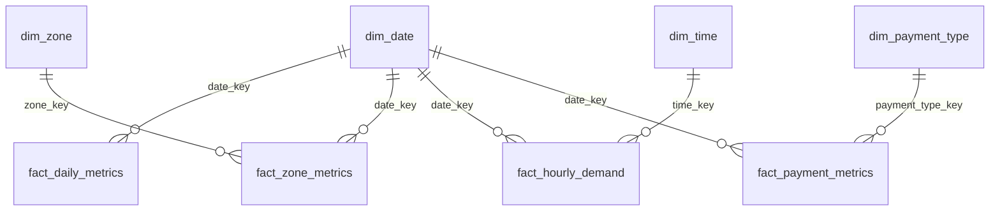

# Modèle de données gold

La couche gold est un **modèle dimensionnel**. Des **dimensions** (attributs
descriptifs réutilisables) sont séparées des **faits** (mesures à un grain explicite),
et trois **sorties KPI** orientées BI sont dérivées des faits.

Code : `src/taxi_pipeline/gold/` : `dimensions.py`, `facts.py`, `kpis.py`, `tables.py`
(catalogue : grain, clés étrangères, nom publié), `validation.py`, `job.py`.

```
Silver
   ↓
Gold
 ┌──────────────────────────────────────────────────────────────┐
 │ Dimensions   dim_date · dim_zone · dim_payment_type · dim_time │
 │ Faits        fact_daily_metrics · fact_zone_metrics            │
 │              fact_hourly_demand · fact_payment_metrics         │
 │ Sorties KPI  gold_daily_metrics · gold_pickup_zone_metrics     │
 │              gold_hourly_demand   (dérivées des faits)         │
 └──────────────────────────────────────────────────────────────┘
   ↓
PostgreSQL : 11 tables, clés primaires = grain, clés étrangères fait → dimension
   ↓
BI
```



## Dimensions

| Dimension | Clé | Lignes (T1 2023) | Contenu |
|---|---|---|---|
| `dim_date` | `date_key`, entier `YYYYMMDD` | 90 | `date`, `year`, `quarter`, `month`, `month_name`, `iso_week`, `week_start` (lundi), `day_of_month`, `day_of_week` (ISO : 1 = lundi), `day_name`, `is_weekend` |
| `dim_zone` | `zone_key` = numéro officiel de *community area* ; `-1` = inconnue | 78 | `community_area`, `zone_name`, `side` (secteur de la ville) |
| `dim_payment_type` | `payment_type_key` | 7 | `payment_type`, avec la normalisation de la silver (`null` → `Unknown`) |
| `dim_time` | `time_key` = heure (0-23) | 24 | `hour`, `hour_label` (`08:00`) |

- **`dim_date`** est générée par `sequence`, entre la première et la dernière date de la
  silver : un jour sans trajet resterait présent dans le calendrier.
- **`dim_zone`** vient du référentiel versionné `seeds/community_areas.csv` (77 zones),
  plus un membre « Unknown / outside Chicago » (clé `-1`). Les trajets sans zone ou avec
  une zone hors référentiel y sont rattachés : aucun trajet n'est perdu par la jointure.
  La clé réutilise l'identifiant officiel de la ville plutôt qu'une clé inventée.
- **`dim_time`** ne porte que l'heure : le jour de semaine est un attribut de la date,
  donc de `dim_date`.
- **Pas de SCD** : calendrier, zones et moyens de paiement ne changent pas dans le temps.

## Faits

| Fait | Grain (clé primaire) | Dimensions | Lignes (T1 2023) |
|---|---|---|---|
| `fact_daily_metrics` | `date_key` : un jour | date | 90 |
| `fact_zone_metrics` | `date_key` × `zone_key` : un jour, une zone de prise en charge | date, zone | 6 977 |
| `fact_hourly_demand` | `date_key` × `time_key` : un jour, une heure de début | date, heure | 2 159 |
| `fact_payment_metrics` | `date_key` × `payment_type_key` : un jour, un moyen de paiement | date, paiement | 621 |

Une ligne n'existe que si au moins un trajet correspond au grain. Par exemple,
`fact_hourly_demand` compte 2 159 lignes et non 90 × 24 = 2 160 : le 2023-03-12 à 02:00
n'existe pas à Chicago (passage à l'heure d'été).

**Mesures**

| Mesure | daily | zone | hourly | payment |
|---|---|---|---|---|
| `nb_trips`, `total_revenue` | ✓ | ✓ | ✓ | ✓ |
| `total_trip_minutes`, `total_trip_miles` (additives) | ✓ | ✓ | ✓ | ✓ |
| `avg_revenue_per_trip` | ✓ | ✓ | ✓ | ✓ |
| `avg_trip_minutes`, `avg_trip_miles` | ✓ | ✓ | ✓ | |
| `total_fare`, `median_trip_minutes`, `tip_rate_pct`, `active_taxis` | ✓ | | | |
| `total_tips` | ✓ | | | ✓ |
| `avg_tip_pct` | | | | ✓ |

## Sorties KPI

| Table PostgreSQL | Grain | Dérivée de | Contenu |
|---|---|---|---|
| `gold_daily_metrics` | jour | `fact_daily_metrics` + `dim_date` | nb trajets, revenu total, revenu moyen par trajet, durée moyenne et médiane, distance moyenne, fare et pourboires totaux, taux de pourboire, taxis actifs, `week_start` |
| `gold_pickup_zone_metrics` | zone, sur toute la période | `fact_zone_metrics` + `dim_zone` | rang, nb trajets, part des trajets, revenu total et moyen, durée et distance moyennes |
| `gold_hourly_demand` | jour de semaine × heure | `fact_hourly_demand` + `dim_date` | trajets, nombre de jours, trajets moyens par jour, durée et revenu moyens |

Ces tables sont les sorties de la gold d'origine, conservées avec leur nom, leur schéma
et leur sémantique : les requêtes et tableaux de bord existants ne sont pas impactés. La
non-régression a été vérifiée cellule par cellule (voir
[qualité des données](data-quality.md#6-non-régression-lors-du-passage-à-la-gold-dimensionnelle)).
`gold_hourly_demand` garde sa numérotation historique des jours (`day_of_week_num`,
1 = dimanche), alors que `dim_date` suit la norme ISO.

Ce sont des tables matérialisées plutôt que des vues : une vue dépendant des faits
empêcherait la substitution atomique des tables à la publication. Elles ne font que
quelques centaines de lignes.

## Choix de modélisation

- **Pourquoi un modèle dimensionnel.** Les trois KPI historiques répondaient chacun à une
  question figée. Avec des faits à grain explicite et des dimensions partagées, une
  nouvelle question (week-end contre semaine par secteur, pourboires par mois et moyen de
  paiement…) devient une jointure SQL, sans nouveau code Spark.
- **Mesures additives.** Chaque fait porte des comptes et des sommes à côté des moyennes.
  Une moyenne sur une période plus large se recalcule exactement (somme / somme), jamais
  en moyennant des moyennes. La médiane et le nombre de taxis distincts, non additifs, ne
  sont calculés qu'au grain jour.
- **`fact_hourly_demand` au grain date × heure** plutôt que jour de semaine × heure : ce
  dernier grain ne serait que la sortie KPI sous un autre nom, et ne serait pas additif.
  Le profil jour de semaine × heure se dérive exactement du fait : le nombre de jours
  observés sur un créneau est le nombre de lignes du fait.
- **`fact_payment_metrics`** existe pour que `dim_payment_type` serve à un fait : une
  dimension qu'aucun fait ne référence n'a pas d'usage analytique.
- **Pas de fait au grain trajet.** Les cas d'usage BI du sujet portent sur des KPI
  agrégés : un fait d'environ 1,4 million de lignes par trimestre dans PostgreSQL
  n'apporterait rien à ces usages. Le détail par trajet reste disponible dans la silver
  (Parquet, interrogeable avec Spark).
- **Dimensions et faits reconstruits ensemble** à chaque run (full refresh) : les clés
  sont toujours cohérentes entre les tables publiées ensemble, sans gestion de clés de
  substitution persistantes.

## Exemples de requêtes

```sql
-- Revenu moyen par trajet : semaine vs week-end, par secteur de la ville
SELECT d.is_weekend, z.side, SUM(f.nb_trips) AS trips,
       ROUND(SUM(f.total_revenue) / SUM(f.nb_trips), 2) AS avg_revenue_per_trip
FROM fact_zone_metrics f
JOIN dim_date d USING (date_key)
JOIN dim_zone z USING (zone_key)
GROUP BY d.is_weekend, z.side
ORDER BY d.is_weekend, trips DESC;

-- Part des pourboires dans le revenu, par mois et moyen de paiement
SELECT d.month, d.month_name, p.payment_type, SUM(f.nb_trips) AS trips,
       ROUND(100 * SUM(f.total_tips) / SUM(f.total_revenue), 2) AS tips_share_pct
FROM fact_payment_metrics f
JOIN dim_date d USING (date_key)
JOIN dim_payment_type p USING (payment_type_key)
GROUP BY d.month, d.month_name, p.payment_type
ORDER BY d.month, trips DESC;

-- Profil horaire moyen : jours ouvrés vs week-end
SELECT t.hour_label, d.is_weekend,
       ROUND(SUM(f.nb_trips)::numeric / COUNT(DISTINCT f.date_key), 1) AS avg_trips_per_day
FROM fact_hourly_demand f
JOIN dim_date d USING (date_key)
JOIN dim_time t USING (time_key)
GROUP BY t.hour, t.hour_label, d.is_weekend
ORDER BY d.is_weekend, t.hour;
```

Les clés étrangères étant déclarées dans PostgreSQL, DBeaver, Power BI ou Metabase
détectent automatiquement les relations entre faits et dimensions.
